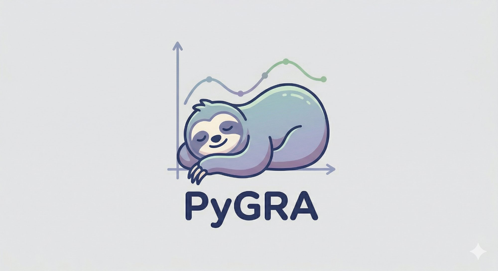

# PyGRA

<p align="center">
  
</p>

**PyGRA** is an interactive scientific data plotter built with Python, PyQt5, and matplotlib, inspired by xmgrace.

Works on **macOS**, **Linux**, and **Windows**. On macOS the menu bar appears in the system bar at the top of the screen.

## Features

- Load multiple whitespace-delimited data files (`.dat`, `.txt`, `.csv`, ...)
- Per-series column selection for x, y, and optional x/y error bars
- Multiple plots from the same file with independent settings
- Histogram mode with bin control and normalisation (count / density / probability)
- Fit & Interpolation: spline, linear, polynomial, Gaussian, Exponential, Maxwell-Boltzmann, Poisson, custom formula
- Fit results appear automatically as dashed overlay curves, listed in a dedicated panel with per-layer visibility and remove controls
- Data transforms: multiply/divide/add/subtract, normalize, numerical derivative, moving average
- Appearance dialog: line style, width, marker shape, size, colors — triggers auto-replot on OK
- Axis labels, title, log scale, manual limits
- Font size control, major/minor ticks and grid
- Plot themes (default, dark, seaborn, ggplot, bmh, grayscale)
- Save figure as PNG, PDF, SVG with configurable DPI
- Save/load full sessions as JSON
- Minimal custom toolbar: Zoom, Pan, Reset

## Installation

### With conda (recommended)

```bash
conda env create -f environment.yml
conda activate pygra
```

Or install into an existing environment (e.g. your oxDNA environment):

```bash
conda activate oxdna
pip install -e .
```

### With pip

```bash
pip install -r requirements.txt
pip install -e .
```

## Usage

```bash
pygra
```

### Interface overview

**Left panel:**
- **Load files** — opens one or more data files
- **Series tabs** — one tab per loaded series; each tab has column selectors, label, Appearance button, visibility checkbox
- **Fit & interpolation layers** — lists active fit curves with visibility toggle and remove button
- **Axis settings** — labels, title, log scale, limits
- **Plot** — renders the figure

**Menu bar:**

| Menu     | Action                     | Shortcut   |
|----------|----------------------------|------------|
| File     | Load session               | Ctrl+L     |
| File     | Save session               | Ctrl+S     |
| File     | Export active data         | —          |
| Analysis | Transform data             | Ctrl+T     |
| Analysis | Statistics                 | Ctrl+I     |
| Analysis | Fit & Interpolation        | Ctrl+F     |
| View     | Style settings             | Ctrl+,     |

### Command-line interface

```bash
pygra
pygra --file base.dat --file unique.dat
pygra --file plot_*.dat
pygra --file base.dat --x 0 --y 3 --file unique.dat --x 0 --y 5
pygra --file base.dat --file unique.dat --x 0 --y 3
pygra --load session.json
pygra --help
```

**CLI rules:**
- `--x` / `--y` immediately after `--file` apply to that file only
- `--x` / `--y` after all `--file` arguments apply to all files
- Default: x=0, y=1
- Glob patterns are expanded by the shell automatically

## File format

Whitespace-delimited, one row per data point. Lines starting with `#` are ignored.

```
# x   y    dy
0     1.0  0.05
1     2.3  0.08
2     1.8  0.06
```

## Project structure

```
PyGRA/
├── pygra.py              # convenience script
├── pyproject.toml
├── environment.yml
├── requirements.txt
├── pygra_logo.png
├── README.md
├── CHANGELOG.md
├── LICENSE
└── pygra/
    ├── __init__.py
    ├── main.py           # CLI entry point (pygra command)
    ├── constants.py      # shared constants
    ├── dataset.py        # data loading and transforms
    ├── fitting.py        # distribution and custom fits
    ├── dialogs.py        # all dialogs
    ├── widgets.py        # DatasetWidget
    ├── mainwindow.py     # MainWindow with FitLayer management
    └── state.py          # session save/load
```

## Dependencies

- Python >= 3.11
- numpy >= 1.24
- scipy >= 1.10
- matplotlib >= 3.7
- PyQt5 >= 5.15

## License

MIT — see [LICENSE](LICENSE).

## Author

Francesco Tosti Guerra
